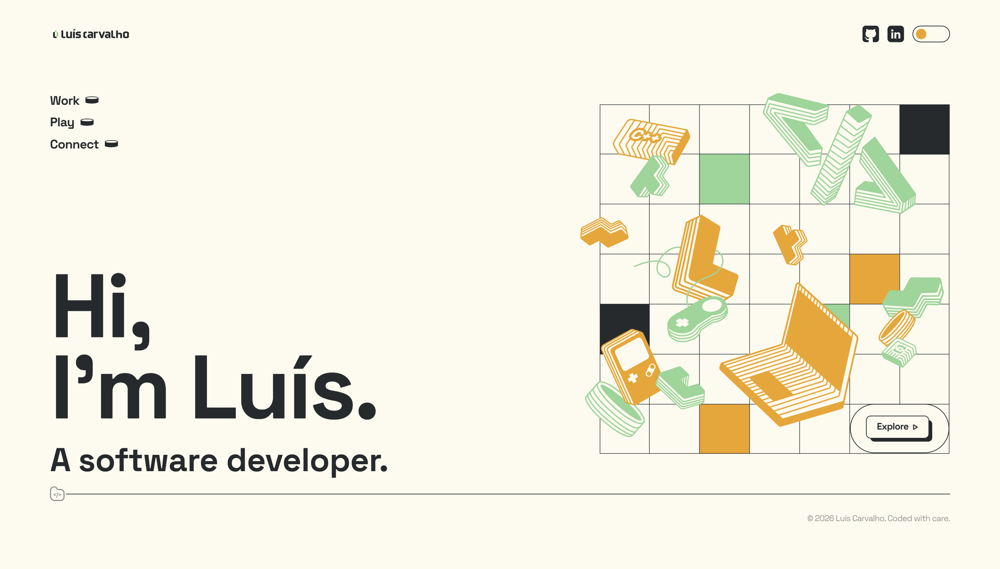

# personal-website

My personal site: a SvelteKit app built from my own Figma brand, with every component, transition and micro-interaction written from scratch rather than pulled from a library.

**Live:** https://lepc.dev



## What it is

A six-page portfolio that is as much a design exercise as a code one. The brand, the layout and the illustrations are mine (Figma, "Personal Rebranding"), and the build follows them closely: the hero's 7x7 illustration grid, the racetrack carousel on Explore, the keycaps that depress when you press them. There is no component library and no CSS framework behind any of it, just Svelte 5 and hand-written CSS.

## Layout

```
  src/
   |-- routes/
   |    |-- +page.svelte      home: hero illustration grid + explore keycap
   |    |-- work/  play/      card shelves with a custom scrollbar
   |    |-- explore/          best runs: racetrack carousel
   |    |-- connect/          photo card + resume keycap
   |    +-- resume/           an A4 document, also rendered to static/resume.pdf
   |-- lib/
   |    |-- components/       Header, Footer, Splash, ThemeToggle, CardShelf,
   |    |                     ProjectCard, WorkCard, SubPage, Scrollbar
   |    +-- data/projects.ts  the project lineup behind every card
   +-- app.css                brand tokens + light/dark semantics

  scripts/resume-pdf.mjs      renders /resume to a print-ready A4 pdf
  scripts/favicons.mjs        renders the logomark into the favicon set
  scripts/og-image.mjs        renders the 1200x630 link-preview card
```

## Features

- **Drawn from the design, not approximated.** Geometry comes from the real Figma coordinates (the hero grid is 7x7, the panels are positioned as percentages of the frame), so the build matches the source rather than resembling it.
- **Scales as one piece.** Container queries drive the type and spacing, so a page is sized once and every element inside follows. Nothing is pinned to a fixed pixel width.
- **The resume is a real document.** `/resume` renders an A4 sheet on screen at the same size it prints, so the page you see is the pdf. The download button serves a pre-rendered file instead of opening the print dialog.
- **Light and dark.** Themed through `--paper` and `--ink` semantic properties over a four-colour brand palette, set before first paint to avoid a flash of the wrong theme.
- **Splash once per session.** A retro loading bar on first visit, skipped on later navigations via `sessionStorage`.
- **Responsive down to the phone.** Sub-pages switch to the portrait frames from the design, with the Explore carousel turning into a vertical capsule.

## Tech stack

SvelteKit · Svelte 5 (runes) · TypeScript · Vite · CSS container queries · puppeteer-core · Space Grotesk (self-hosted variable font)

## Running locally

```bash
npm install
npm run dev          # http://localhost:5173
```

```bash
npm run build        # production build
npm run preview      # preview that build
npm run check        # svelte-check
```

## Regenerating the resume pdf

`static/resume.pdf` is committed, so it goes stale if the resume content changes. With the dev server running:

```bash
npm run resume:pdf
```

It renders `/resume` to A4, prints how much of the sheet the content fills, and warns if it would spill onto a second page.

## Regenerating the icons and link preview

Both sets are committed under `static/`, rendered from the brand rather than drawn by hand, so re-run these only when the logomark or wording changes:

```bash
npm run favicons     # favicon.ico, apple-touch-icon.png, icon-192/512.png
npm run og           # og.png, the 1200x630 card shown when a link is shared
```

The icons are served from `static/` rather than imported through Vite on purpose: an asset that small gets inlined as a `data:` URI, which leaves no URL for Google's favicon crawler or for anything fetching `/favicon.ico` to find.

## Notes

The design is my own work. Project screenshots under `static/projects/` are of my own software, apart from the Village du Soir card, which is client work at Eclypsys shown with the app's public store listings.
